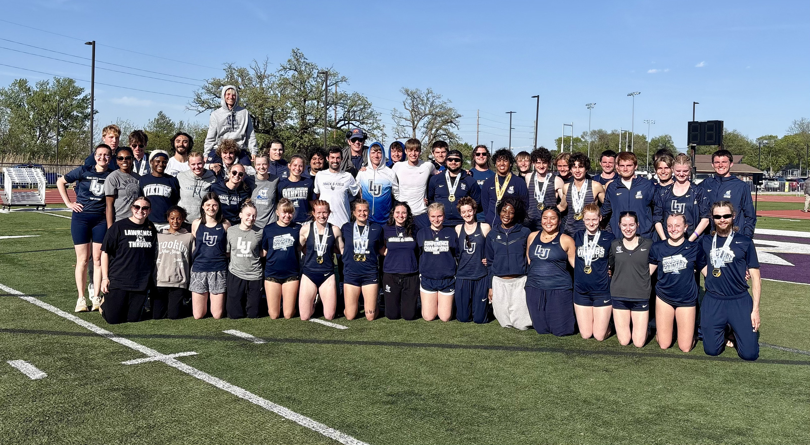

# Student Life

As a student at Lawrence University I have taken courses across a wide range of fields,
with a primary focus on Mathematics, Computer Science, and Data Science, with an honorable
mention to Physics. Besides these, I have also taken a handful of classes across the 
Humanities and Social Sciences as well. In my time as a student at Lawrence, I have
received several academic awards and honors, including but not limited to the Lawrence University 
Donald Knuth Prize in Computer Science. This is awarded annually to the outstanding 
graduating senior majoring in Mathematics-Computer Science. I am very proud of my 
time as a student at Lawrence, and I am happy to forever be a Lawrentian!

Find below a comprehensive list of all Math, Computer Science, and Data Science Courses I have taken here at Lawrence. 
Information on the full list of courses across these fields can be found [here](https://www.lawrence.edu/academics/college/mathematics/course-descriptions) for Math/Stats/Data Science and [here](https://www.lawrence.edu/academics/college/computer-science/course-descriptions) for Computer Science.

## Math/Statistics

- MATH 155: Multivariable Calculus
- MATH 230: Discrete Mathematics
- MATH 200: Complex Sequences and Series
- MATH 223: Quantitative Decision-Making
- MATH 340: Probability
- MATH 250: Linear Algebra
- MATH 505: Group Theory
- MATH 535: Complex Analysis
- MATH 699: IS-Math Capstone
- STAT 255: Statistics for Data Science
- STAT 405: Advanced Data Computing
- Course at University of Auckland, New Zealand: MT315 Mathematical Logic

## Computer Science

- CMSC 150: Intro to Computer Science
- CMSC 250: Intermediate Programming
- CMSC 270: Data Structures
- CMSC 510: Data Struct & Algorithm Analysis
- CMSC 208: Statistical Machine Learning
- CMSC 406: Web Development
- CMSC 490: Neural Networks
- CMSC 500: TOP: AI Agents
- CMSC 698: Computer Sci Senior Projects
- CMSC 205: Data-Scientific Programming
- CMSC 600: Computer Sci Senior Seminar
- CMSC 455: Back End Programming
- Course at University of Auckland, New Zealand: AI367 Artificial Intelligence
- Course at University of Auckland, New Zealand: CS316 Cyber Security

# Athlete Life

During my time at Lawrence I competed as a part of the [Track and Field team](https://vikings.lawrence.edu/sports/mens-track-and-field). This involved Fall training, along with both an Indoor and Outdoor competition season. During my tenure, I scored points at all 8 Conference Championships I participated in, along with earning all conference (Top 3) medals twice. I also received the Midwest Conference Elite 20 Academic award 3 times, becoming the first ever Lawrence Track and Field athlete to do so. This award is presented to the scoring athlete with the highest gpa at the Conference Championship, and can only be won once each academic year. On top of these accolades, I also hold 4 school records in the indoor 4x200m relay, indoor 4x400m relay, indoor Sprint Medley Relay, and the indoor Heptathlon. Despite the large amounts of extra stress and strain being an athlete on this team was, I wouldn't trade it for the world. I love my team, and have learned so many valuable skills during my time as an athlete. These include but are not limited to time management, teamwork, and leadership skills. See below an image of me and my team at my last ever Conference Championship.

{fig-align="center" width="100%"}