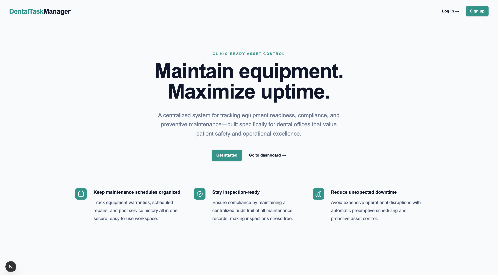

For my computer science senior capstone, I begun working on a small business
with two partners, Jamie Vee and Aaron Stathopoylos. Jamie is on the 
business side of things, and me and Aaron have been developing our product. This 
product is called DEMS. The goal is to build a comprehensive system for dental offices
to track and manage all their equipment and equipment maintenance, from purchase through
its entire lifecycle. This is currently a massive hole in the dental industry. We hope to 
deploy in the next several months. We do not have a live demo yet, so this page will showcase a few screenshots and explanations of features. Check back in the near future to get access to a live demo!

Check out my capstone presentation slideshow [here](https://docs.google.com/presentation/d/1MbORzKRsngcCq-gEla-RwL6T6bK70BuzDTsNcXfwPL4/edit?usp=sharing) as well.

# Landing Page

This is an image of the landing page. Here you see some basic explanation of the goal
of the features of the product, as well as a visible login and signup button.

# Admin Dashboard

This is the admin dashboard. Here you see there is a single office account. An important
feature we wanted to incorporate was for admins to be able to oversee several different 
office acccounts, as this is something that is commonly seen in the dental industry. Here
an admin can choose from all the offices they may oversee, as well as adding new clinics under their account.

# Office Dahsboard

This is the office dashboard. Here at first glance you see a few main cards. One shows the head of the full list of equipment, along with a link for offices to view their full fleet of equipment. The next shows
pending, and upcoming maintenance appointments, again along with a link to view the full list. The third showcases recently completed equipments. These links are accessible both through these cards, and in the lefthand user panel. There are also various other links for offices to view their profiles, add new equipment, etc. You may also notice a link to our AI Invoice tool. The purpose of this tool is to manually read equipment invoices, and update office records accordingly. The goal here is to save large amounts of time and labor on tedious data entry.

# Overview of Features

The primary features, some of which are mentioned above, are the following

- Maintain Admin and Office accounts for clean management of single branches to chains of clinics
- Record and maintain comprehensive list of equipment for each office, including all pertinent details such as maintenace requirements, warranty information, neccessary parts, etc.
- Record and maintain comprehensive list of all pending, scheduled, and completed maintenance appointments
- Automated maintenance appointment scheduling. Simply record your top 2 or 3 maintenance companies, along with their contact information as a part of your office profile. Then with a simple click of a button you can send a generated email requesting a maintenance appointment for a specific piece of equipment. This cuts out on manually scheduling, allowing it to happen all in one place. 
- AI Assistant to automate tedious data entry

The goal here is to save time, and increase productivity by providing a simple and organized one stop shop for all dental equipment tracking needs.